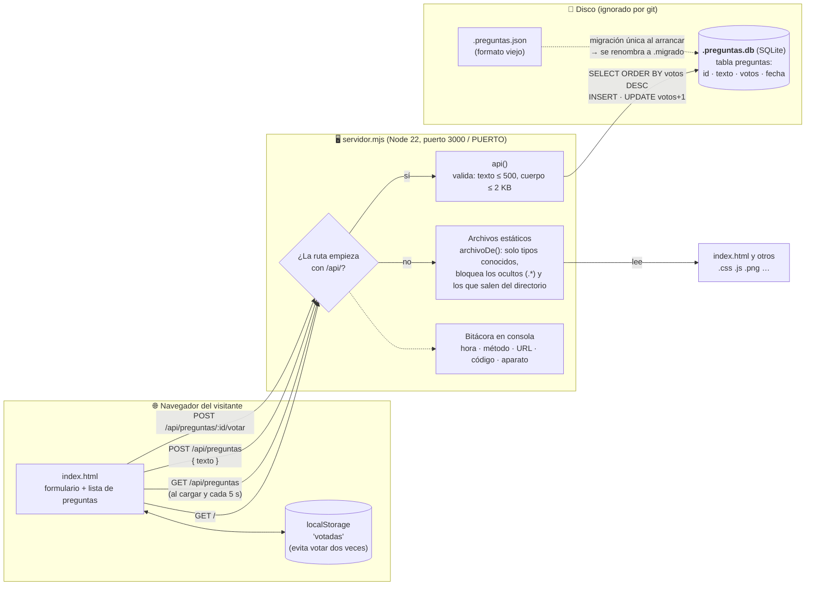
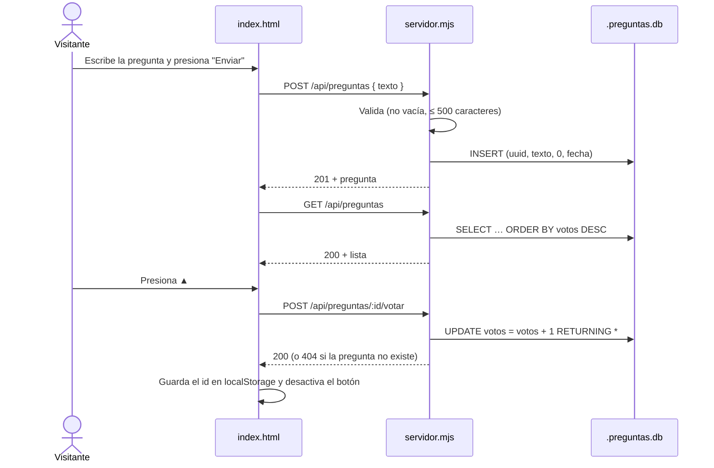

# Diagrama del sistema

## Componentes

```mermaid
flowchart LR
    subgraph Navegador["🌐 Navegador del visitante"]
        HTML["index.html<br/>formulario + lista de preguntas"]
        LS[("localStorage<br/>'votadas'<br/>(evita votar dos veces)")]
        HTML <--> LS
    end

    subgraph Servidor["🖥️ servidor.mjs (Node 22, puerto 3000 / PUERTO)"]
        Router{"¿La ruta empieza<br/>con /api/?"}
        Estaticos["Archivos estáticos<br/>archivoDe(): solo tipos conocidos,<br/>bloquea los ocultos (.*) y los que salen del directorio"]
        API["api()<br/>valida: texto ≤ 500, cuerpo ≤ 2 KB"]
        Log["Bitácora en consola<br/>hora · método · URL · código · aparato"]
        Router -- no --> Estaticos
        Router -- sí --> API
        Router -.-> Log
    end

    subgraph Datos["💾 Disco (ignorado por git)"]
        DB[("<b>.preguntas.db</b> (SQLite)<br/>tabla preguntas:<br/>id · texto · votos · fecha")]
        JSON[".preguntas.json<br/>(formato viejo)"]
    end

    HTML -- "GET /" --> Router
    HTML -- "GET /api/preguntas<br/>(al cargar y cada 5 s)" --> Router
    HTML -- "POST /api/preguntas<br/>{ texto }" --> Router
    HTML -- "POST /api/preguntas/:id/votar" --> Router

    Estaticos -- "lee" --> Archivos["index.html y otros<br/>.css .js .png …"]
    API -- "SELECT ORDER BY votos DESC<br/>INSERT · UPDATE votos+1" --> DB
    JSON -. "migración única al arrancar<br/>→ se renombra a .migrado" .-> DB
```

## Enviar una pregunta y votar

```mermaid
sequenceDiagram
    actor V as Visitante
    participant P as index.html
    participant S as servidor.mjs
    participant D as .preguntas.db

    V->>P: Escribe la pregunta y presiona "Enviar"
    P->>S: POST /api/preguntas { texto }
    S->>S: Valida (no vacía, ≤ 500 caracteres)
    S->>D: INSERT (uuid, texto, 0, fecha)
    S-->>P: 201 + pregunta
    P->>S: GET /api/preguntas
    S->>D: SELECT … ORDER BY votos DESC
    S-->>P: 200 + lista
    V->>P: Presiona ▲
    P->>S: POST /api/preguntas/:id/votar
    S->>D: UPDATE votos = votos + 1 RETURNING *
    S-->>P: 200 (o 404 si la pregunta no existe)
    P->>P: Guarda el id en localStorage y desactiva el botón
```
